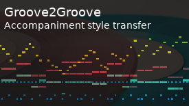
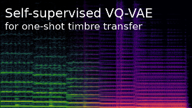
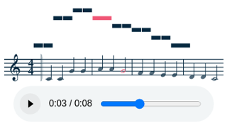
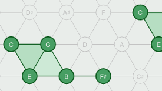
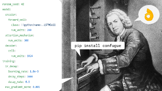

### 👋 Hi there, I'm Ondřej!

### My projects

    

<!--
**cifkao/cifkao** is a ✨ _special_ ✨ repository because its `README.md` (this file) appears on your GitHub profile.

Here are some ideas to get you started:

- 🔭 I’m currently working on ...
- 🌱 I’m currently learning ...
- 👯 I’m looking to collaborate on ...
- 🤔 I’m looking for help with ...
- 💬 Ask me about ...
- 📫 How to reach me: ...
- 😄 Pronouns: ...
- ⚡ Fun fact: ...

-->

### Contact me

Find me on [Twitter](https://twitter.com/cifkao) or contact me the [GitHub way](https://github.com/cifkao/cifkao/discussions)!
