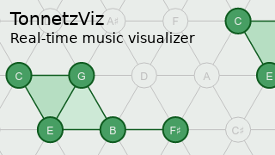

### 👋 Hi there, I'm Ondřej!

### My projects

     

### Also my projects

- [jax-spectral](https://github.com/cifkao/jax-spectral) – short-time Fourier transform (STFT) for JAX
- [gps2var](https://github.com/cifkao/gps2var) – reading geospatial variables by GPS coordinates
- [chrome-mute-notifications](https://github.com/cifkao/chrome-mute-notifications) – a button for Chrome to disable all desktop notifications
- [fclip](https://github.com/cifkao/fclip) – a command-line file system clipboard
- [pybiab](https://github.com/cifkao/pybiab) – some Band-in-a-Box automation scripts
- [import-as.github.io](https://import-as.github.io/) – list of Python import shorthands

### Contact me

Find me on [Twitter](https://twitter.com/cifkao), use [this contact form](https://forms.gle/GcEFJNo1bbKu8HmE6) or contact me the [GitHub way](https://github.com/cifkao/cifkao/discussions)!
